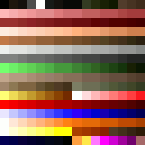
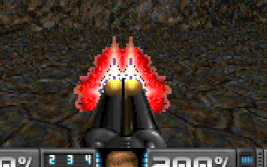
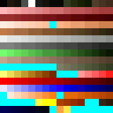
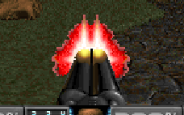

This is a "limited" version of the Doom palette for making gameplay mods which
are "compatible" with various Doom WADs that use custom palettes. Specifically
this palette is compatible with the following:

* [Back to Saturn X](https://doomwiki.org/wiki/Back_to_Saturn_X) episode 1 & 2
* [Doom 2 the Way id Did](https://doomwiki.org/wiki/Doom_2_the_Way_id_Did)
* [Sunlust](https://doomwiki.org/wiki/Sunlust)

Not supported is [Ancient Aliens](https://doomwiki.org/wiki/Ancient_Aliens);
its palette is too different to Doom's original palette to make something
compatible.

## How to use with deutex

If you're using [deutex](https://doomwiki.org/wiki/DeuTex) to build your WADs,
this is easy to use. Simply copy `doom2.wad` from this repository and add
`-doom2 doom2.wad` to the deutex command line. For example:

```
deutex -doom2 doom2.wad -build wadinfo.txt my-wad.wad
```

## Explanation

Back to Saturn X (along with other mods listed above) has a palette that is a
derivative of the Doom palette. The following animation shows how the two
differ:



The result is that if a mod is created for Doom's stock palette, most of the
image will display correctly under the modified palette, but there will likely
be "patches" with wrong-color artifacting caused by the disparity. Here's an
example from a weapons mod that increases the number of animation frames for
Doom's weapons:



Most of the weapon displays correctly but there are purple areas in the gun
flash caused by the fact that the BTSX palette replaces part of the
white/yellow color range with purple colors.

The limited palette here takes the Doom palette and "blocks out" entries in
the palette which have been changed in popular PWADs. The changed color
entries are replaced by cyan, which is usually used in Doom editing for
transparency. When converting graphics to this palette, these palette entries
will therefore be avoided:



When built with the limited palette, the artifacting then disappears:



